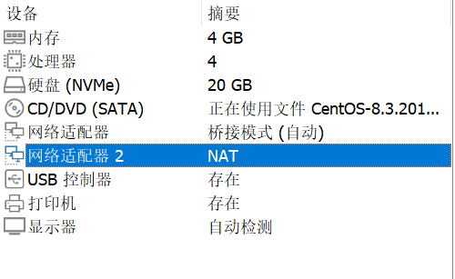
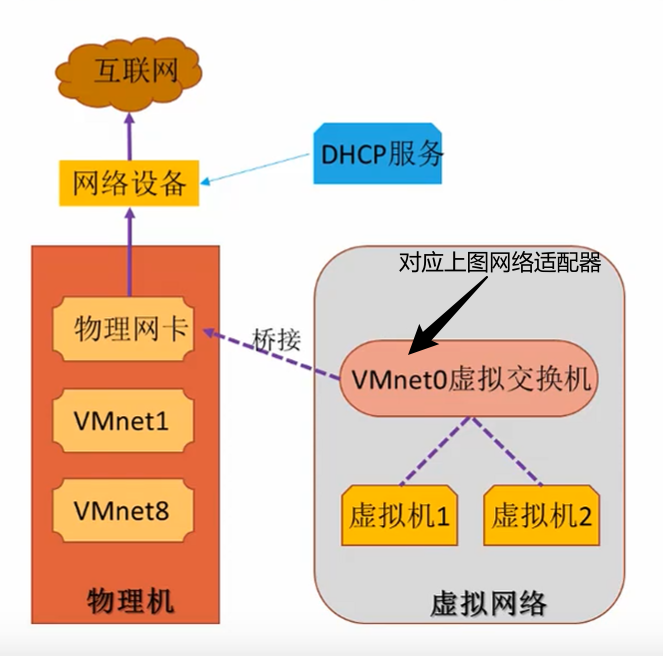
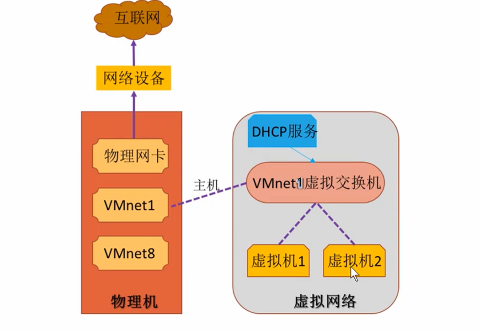
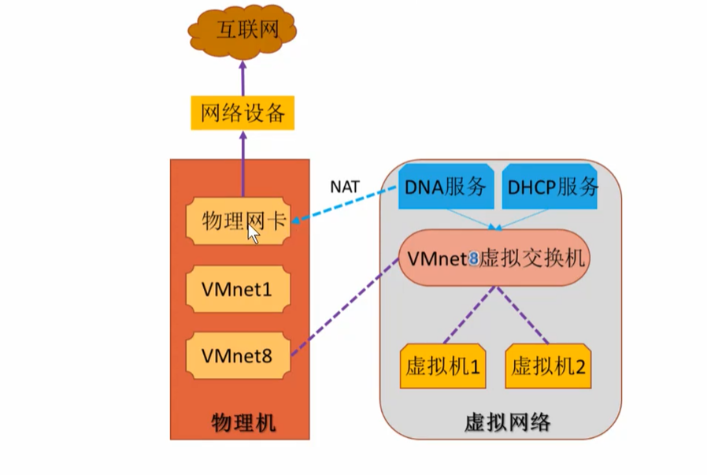
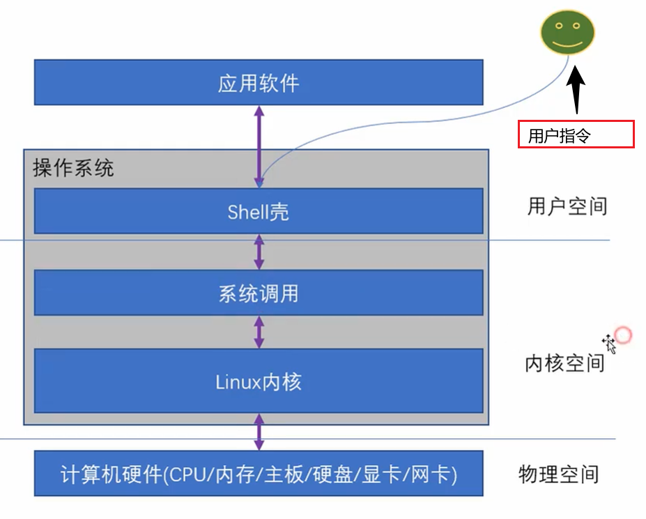
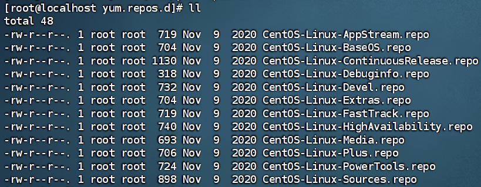
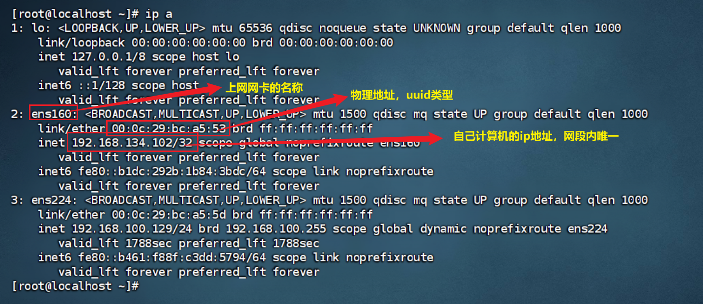
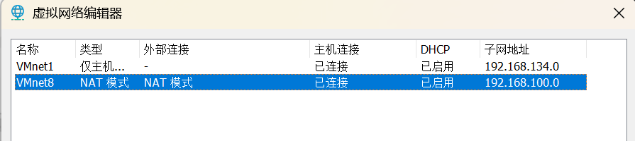
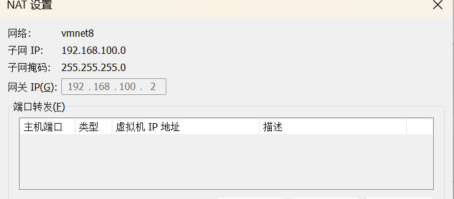

# 虚拟化介绍

虚拟化（Virtualization）是一种资源管理器，将计算机资源（CPU、内存、磁盘和网卡），予以抽象、转换后呈现出来并可以随意分割、组合的计算机配件环境，通过这些虚拟配件，可以虚拟出若干台逻辑计算机，每台计算机独立运行、互不干扰，可以同时运行不同的操作系统和应用程序，这些虚拟出的资源不受物理资源限制。

## 虚拟机母机配置要求

最低：CPU >= 2 真核 ，内存 >= 12G ，硬盘 >= 固态256G

最低：CPU >= 6 真核 ，内存 >= 24G ，硬盘 >= 固态1T

最低：CPU >= 8 真核 ，内存 >= 32G ，硬盘 >= 固态2T

母机开启物理虚拟化功能：在电脑主板打开 `VT-X` 或 `SVM Mode` 根据每家主板不一致，进入BIOS 方式不一致 

## 网络模式

-   桥接模式：网络适配器1
-   NAT模式：网络适配器2
-   仅主机模式：并未设置



### （1）桥接模式 Bridged Adapter

虚拟交换机直连物理机的物理网卡模式，对进出数据包不起任何限制和翻译（NAT）

虚拟机的 IP 地址，来源于物理网络，一般在物理网络中有`DHCP`服务器，由它提供与物理网卡在同一`VLAN`的 IP地址



### （2）仅主机模式 Host-only Adapter

在虚拟交换机直连物理机的`VMnet1` 虚拟网卡，对进出数据包不起任何限制和翻译（NAT）

虚拟机的 IP 地址，来源于物理网络，由它分配 IP 地址，IP地址范围与`VMnet1`网卡IP地址网段一致，但可以自己指定

`VMnet1`网卡是独立的虚拟网卡，它与物理网卡没有任何关联，所以该模式下虚拟机只能内部通讯，不能上网



### （3）NAT模式 Network Address Translation

Wmware workstation 软件会产生1个NAT路由设备，vmnet8虚拟机也直连这个NAT设备

虚拟机的IP地址，来源于虚拟网络（未注册的专用Ip地址），它与物理网卡没有任何关联，只能用于母机和虚拟机通讯，若希望和外部网络通信，由NAT将 Internet 传入的数据包将公用地址转换位专用地址（IP地址映射）。



# Linux 登录

1、Linux 操作系统组成



2、Linux本地登录

登录Linux操作系统，称为登录计算机，有两种方式：本地终端登录、远程终端登录

早期计算机都有键盘、鼠标、显示器等硬件设备，称作输入、输出设备，也叫物理控制台

（1）本地终端登录，登录成功获取窗口叫做 `tty`

（2）远程`ssh`登录Linux，获取Shell 窗口叫做 `伪终端`，用`pts`表示 ，多个用户可以多次登录，可以通过不同的软件如Final Shell、Xshell 等实现

# Linux基础命令

## 1、浏览目录类命令

### ls命令

```bash
# ls [参数] [目标或文件]
参数：
-a:显示所有文件，包括"."开头的隐藏文件
-c：按文件修改时间排序 
-l：以长格形式拿到详细信息
-tr: 以时间逆序方式排列修改时间的文件
# eg：
ls /   查看根目录
ls -al   以列表形式查看所有目录，包括隐藏目录
ls -lh   以列表形式，同时可查看文件大小
```


### cd命令

```bash
#cd [参数] 文件名  作用：查看文件内容或者合并多个文件
参数：
-b：对输出内容的非空行进行标注行号
-n：对所有行进行标注行号
# cat 文件1 > 文件2 ：将1的内容写入2中，会覆盖  (>>：追加)
cat text.txt >> text1.txt   # 将text.txt 内容追加到 text1.txt中
```


### more命令

```bash
# more [参数] 文件名
参数：
-num：num为数字，分页时显示每行的行数
+num：指定文件从第num行开始显示
Enter:换行  Space：向下移动一页 q：退出
```

### less命令

```bash
less:（more升级版）：可以前后、上下翻页移动
```


### head / tail 命令

```bash
head：显示开头多少行
tail：显示文件末尾多少行
tail -n [num] 显示文件末尾多少行
tail +[num]   从第num行开始显示指定文件内容
```


## 2、目录操作类命令

### mkdir

Make Directory  创建文件夹

mkdir  [ -p]  路径  **-p表示可自动创建不存在的父目录，适用于创建连续多层级目录**

eg: mkdir ./text2  在根目录下一级创建text2文件夹

eg:  mkdir ../text3  在上级目录中创建text3文件夹

```bash
mkdir ./dir   # 利用相对路径创建文件夹
mkdir /etc/...  # 绝对路径创建文件夹
mkdir -p ./dir1/dir2   # 即使dir1不存在也可以创建成功
```


```bash
# rmdir [参数] 目录名 : 删除空目录
-p 删除该空目录时，一起删除不含其他文件目录的文件夹
```


## 3、文件操作类命令

### cp 命令

```bash
cp [源文件] [目标文件]   # 复制单个文件
cp 文件1 文件2... 目标文件  #复制多个文件
cp ./ma* 目标文件    #通配符复制
-r  : 递归复制文件
-a  : 按照原状态复制文件
```


### touch 命令

**创建文件  .txt**  或者 **更新文件修改日期**

```bash
touch [参数] [文件名]
-d yyyymmdd : 将文件存取或修改时间更新为 yyyy/mm/dd
-a ： 将存取时间改为当前时间
-m ： 将文件修改时间改为当前时间
```


### diff 命令

用于比较文件或目录的差异

```bash
diff [-option] 文件1 文件2
diff [-option] 目录1 目录2
-q    仅报告文件是否不同
-B    忽略空行差异
-w    忽略所有空格差异
-a    将文件视为文本文件（比较二进制文件时有用）
# 无差异时返回值为 0 存在差异返回非0
```


### echo 命令

```bash
# 将数据写入文件
echo [参数] '写入内容' >/>> 文件路径
-e : 处理\n 等转义字符
eg：
echo 'string'  # 打印string
echo *   # 和ls命令相同
echo `pwd`  # 将pwd（查看当前目录）指令当作命令执行
```


### wc 命令

用于统计文件内容的实用命令，可以计算文件的字节数、字数、行数等信息。

```bash
wc [-option] 文件1 文件2 ...
-c  统计字节数
-m  统计字符数
-l  统计行数
-w  统计单词数
-L  显示最长行的长度

# 统计文件行数
$(wc -l < file.txt)
```


```bash
# wc 命令的应用（结合管道）
# 1、统计当前进程数量
ps aux | wc -l
# 2、统计日志文件中出现错误的次数
grep "ERROR" 日志文件名 | wc -l
# 3、统计唯一IP的访问数量
cat access.log | awk '{print $1' | sort | uniq | sc -l
```


### csplit 工具

用于根据上下文内容分隔文件的工具，于`split`按大小分隔不同，支持正则表达式、行号等条件的灵活分隔

```bash
csplit [选项] 文件 模式 ...
-f <前缀> : 指定输出文件前缀
-b <格式> ：指定输出文件后缀
-n <位数> ：指定数字位数（默认为2）
-k   ：   出错时保留已生成文件
-s   ：   静默模式，不显示输出文件大小
-z   ：   删除大小为0的空文件
-q   ：   不显示错误信息
```


```bash
# 正则表达式分隔
csplit book.txt '/Chapter/'  # 在匹配"Chapter"行前分割
csplit log.txt '/ERROR/ + 1'  # 匹配ERROR的下一行分割
csplit data.txt '/^===$/-1' # 匹配行前一行分割
# 重复分隔
csplit file.txt 5 {4}  # 从第5行开始，每三行分割一次，重复4次
# 使用正则表达式重复分割
csplit log.txt '/^---$/' {*}  # 每次匹配分隔符都分割
```


### mv命令

可以**更改文件位置** 或 **更改文件名**

eg：mv text.txt /root/...

```bash
mv [参数] 源文件/目录  目标文件/目录
参数：
-i ： 提示是否覆盖目标文件/目录
-f ： 无论目标是否存在，强制覆盖
```


### rm命令

```bash
rm [参数] 源文件/目录  目标文件/目录
-i ： 提示用户是否删除
-f : 不提示强制删除
-r ： 递归删除目录，包含目录下文件和子目录
eg:
rm -rf     #递归强制删除
rm -rf/*   #格式化系统
```


### ln 链接命令

```bash
# 软连接：由源文件创建软连接文件，相当于快捷方式调用源文件（若删源文件，则会被删除）
# 硬链接：创建和源文件一样的复制文件（文件地址不同），源文件进行修改，指令复制一份到硬链接文件
ln  源文件/目录  目标文件/目录   # 硬链接
ln -s 源文件/目录  目标文件/目录 # 软链接
```


### 压缩命令

（1）gzip / gunzip 压缩 / 解压 命令

```bash
gzip -v 文件名
gunzip -v 文件名
-v ： 显示被压缩文件的压缩比 或 解压时信息
```


（2）tar 命令   文件打包工具

可以将一系列文件 归档到一个大文件之中 ，也可以解开文档文件以恢复数据

```bash
tar [参数] 文档文件名（新起的） 文档列表  # 将文档列表文件打包到新文档文件中
-v ： 列出详细归档过程
-f ： 指定文档文件名称
-c ： 生成文档文件
-x ： 解开文档文件
-z : 以gzip 格式压缩文件

# eg:"
tar -cvf yy.tar aa tt  # 将当前目录下的aa,tt文件归档yy.tar
tar -xvf y.tar     # 从yy.tar 中恢复数据
tar -czvf yy.tar.gz aa tt  # 归档并压缩文件
tar -xzvf yy.tar.gz       #解压并恢复数据
```


### 查找命令

**which命令：**查看一些列命令的程序文件存放在哪里

命令行实际是'‘'调用一个个二进制可执行程序  .exe

语法  ：which 要查找的命令  

```bash
which cd
```

   

**find 命令** ：按文件名查找文件

语法：find   起始路径  -name  "被查找的文件名"           通配符  text*    模糊查询 

​           find    起始路径  -size  +  -n[kMG]

​    `+ - ` 表示大于小于

​    n 表示数字

​    KMG表示大小单位 k(kb)，M(MB)，G(GB)

eg:   find / -size + 10k

```bash
find 起始路径 -name "被查找文件名"
```

​      

## 4、进程及其他命令    

### who 命令

查看当前登录主机的用户终端信息

```bash
who 参数
```


### ps 命令

主要用户查看系统的进程

```bash
ps [参数]
-a : 当前控制终端的进程
-u : 显示进程的用户名和启动时间
-l : 按长格形式输出
```


### wget 命令

用于在终端中下载网络文件

```bash
wget [参数] 下载地址
-b : 后台下载
-P : 下载到指定目录
-t : 尝试下载次数
-r ：递归下载
-O : 指定文件名和地址
#eg:
wget httP://smile90.net/testfile.zip
wget -r -p httP://smile90.net/   # 递归下载该网站内的所有资源并下载到当前目录下httP://smile90.net 目录中
```


### grep 命令

从文件中通过关键字过滤信息

```bash
grep [-n] 关键字 文件路径
# -n ： 表示在结果中显示匹配的行的行号
```


## 5、管道及重定向符

### 管道符（ | ）

作用：将前一个输出作为后一个输入

```bash
ls -l /user/bin | wc -l   # /user/bin目录信息作为(wc -l 输入)，统计行数
cat 某文件 | grep "xxx"  # 从某文件读取想要的内容
```

### 重定向符（>    >>）

标准输入：从键盘读取用户的输入，然后将数据拿到Shell 程序中使用

标准输出：Shell 程序产生的数据，这些数据一般都是呈现到显示器上供用户查看

| 文件名 | 类型                                     | 文件描述符（fd） | 功能                     |
| ------ | ---------------------------------------- | ---------------- | ------------------------ |
| stdin  | （standard input）<br>  标准输入文件     | 0                | 获取键盘输入数据         |
| stdout | （standard output）<br>  标准输出文件    | 1                | 将正确数据输出到显示器上 |
| stderr | （standard error）<br>  标准错误输出文件 | 2                | 将错误信息输出到显示器上 |

重定向输入：标准输入是数据默认从键盘流向程序，如果改变了它的方向，数据就从其他方向流入

重定向输出：标准输入是数据默认从程序流向显示器，如果改变了它的方向，数据就流向其他方向

**输入重定向：**

| 符号                 | 作用                                                 |
| -------------------- | ---------------------------------------------------- |
| 命令 < 文件          | 将文件作为命令的标准输入                             |
| 命令 << 分界符       | 从标准输入中读入，直到遇见分界符才停止               |
| 命令 < 文件1 > 文件2 | 将文件1作为命令的标准输入，并将标准输出重定向到文件2 |

**输出重定向：**

| 符号                               | 作用                                             |
| ---------------------------------- | ------------------------------------------------ |
| 命令 > 文件1                       | 将标准输出重定向到一个文件中（清空原有文件数据） |
| 命令 2 > 文件                      | 将错误输出重定向到一个文件中（清空原有文件数据） |
| 命令 >> 文件 2>&1<br>命令 &>> 文件 | 将标准输出与错误输出共同写入文件中               |


```bash
命令 [fd(默认为0)] > file      # 将正确数据重定向输出到file文件，覆盖方式
命令 < file      # 将输入重定向从file文件中读取数据
>>     # 追加方式
命令 < file1 > file2    # 从file文件读取数据，输出数据到file2文件中
命令 > file1 fd1>&fd2   # 将fd1 和 fd2 文件描述合并输出到文件
```

<div style="page-break-after:always"></div>


# 用户和组管理及权限

## 1、用户和组

### 1.1 基础概念

`root` 用户拥有操作系统最大权限，而普通用户在许多地方是受限制的

-   普通用户的权限一般在`HOME`目录内是不受限的
-   出了HOME目录，大多数地方，普通用户**仅有只读权限**，无法修改权限
-   Linux 系统下用户账户分为两种：普通用户账户、超级用户账户`root`

用户标识（`UID`）：用来表示用户的数字标识符

组标识（`GID`）：用来表示组的数字标识符

**用户文件**：

（1）`/etc/passwd`文件：存放除去用户密码以外的相关信息

passwd 内部：`用户名:加密口令:UID:GID:用户描述信息:主目录:命令解释器`

（2）`/etc/shadow`文件：存放用户加密口令

内部分为9个域，使用`:`分隔，其中第二个域显示加密后的口令（`!!`：没有密码，`*`：非登录用户）

（2）`/etc/login.defs`文件：建立时根据该文件设置用户某些选项（如登录邮箱目录）

**组文件**：

（1）`/etc/group`文件：存放除去组密码以外的相关信息

（2）`/etc/gshadow`文件：存放组加密口令

### 1.2切换用户命令

**su 命令**

```bash
su - [用户名]
#  - 符号可选，表示是否在切换用户后加上环境遍历
#  切换用户后，可以通过  exit命令 或者 Ctrl + d 退回上一个用户
```

**sudo 命令**

该命令可以为普通的命令授权，临时以`root`身份执行

```bash
sudo 其他命令
# 在其他命令之前，带上sudo，可以临时为该命令授权root
# 不是所有用户都可以使用sudo，需要为普通用户配置sudo认证
```

为用户配置sudo认证

```bash
切换到root用户下，执行visudo命令
在文件最后添加 
文件名 ALL=(ALL) + Tab NOPASSWD:ALL
```


### 1.3 用户、用户组

Linux 可以配置多个用户、用户组，同时用户也可以加入多个用户组中

Linux中关于权限的管控级别有2个：

-   针对用户的权限控制
-   针对用户组的权限控制

比如，针对某文件，可以控制用户的权限，也可以控制用户组的权限（**必须`root`用户**）

（1）用户的命令

```bash
1、创建
useradd [-g] 用户组名 [-d] HOME路径  
# -g : 指定用户的组，不指定-g，会创建同名组并加入
# -d : 指定用户的HOME路径，不指定默认在 /home/用户名 目录下

2、删除
userdel [-r] 用户名
# -r : 删除用户的HOME目录，不加-r，删除用户，HOME保留

3、查看
id 用户名      # 查看完整用户完整信息

4、修改
usermod [选项] 用户名
-g : 变更用户所属组
-d : 修改用户登入目录
-L : 锁定用户，禁止登录系统
-U : 解锁用户，允许登录系统
-u : 修改用户UID
-l : 修改用户账号名称
# usermod -l [修改后账号名] [原账号名]

5、passwd 命令 修改用户账户密码
passwd [选项] [username]
-l : 锁定账户
-u :  口令解锁
```


（2）用户组的命令

```bash
groupadd 用户组名   #创建用户组
groupdel 用户组名   #删除用户组
# 修改组的命令
gpasswd 命令 : 为组添加用户
gpasswd [选项] [用户] [组]    
-a ： 把用户加入组
-d ： 把用户从组中删除
-r ： 取消组密码
-A ： 给组指派管理员
```

## 2、权限

### 2.1 查看权限

通过 `ls -l` 命令可以查看文件详细内容，包括权限的细节

权限信息分为 三部分：

（1）权限细节

首字符：`d`（文件夹）、`-`（文件）

p 管道文件    l  链接文件   b  块设备文件   c 字符设备文件     

第2 ~ 10 字符 ，每三个一组，分别代表：所属用户权限、所属组权限、其他用户权限

```bash
r：读
w：写
x：执行【是否可以cd进入】
# 对文件来说 x 代表是否可以运行脚本程序
# 对目录来说：r代表是否可以读取目录列表，w代表是否可以在目录内进行增、删、改
# x 代表是否能进入该目录
```

（2）文件、文件夹所属用户

（3）文件、文件夹所属组

```bash
drwxr-xr-x. 1 root root 
```


### 2.2 修改权限

文件建立时，系统会自动设置权限，后续修改文件权限通过`chmod`命令

只有文件、文件夹所属用户或者`root`用户才能修改

（1）数字表示法访问

读取`r`：4   ，  写入`w`：2   ， 执行`x`：1  ， 无权限：0，将授权部分相加表示 （所属用户权限、所属组权限、其他用户权限）

（2）文字表示法访问

`u` ：所有者，`g`：所属组 ， `o`：其他用户 ， `a`：以上三种用户

```bash
chmod [-R] 权限 文件或文件夹
-R : 对文件夹内的全部内容应用同样的操作(包含子目录时应用)
+:赋予    
-：减去  
= : 赋予并取消原先权限
# chmod a+x hello.sh   给这个文件所有用户添加执行权限
#  chmod u=rwx 文件/文件夹
```

<div style="page-break-after:always"></div>

# Vim编辑器

## Vim介绍

vim 全称：`visual interface` ，是Linux中最经典的文本编辑器，可以进行输出、删除、查找、块等众多文本操作           

使用方法：`vim + 文件名`

## Vim的工作模式

命令模式（进入vim默认） 、输入模式、末行模式

切换工作模式：输入模式  `i`  、末行模式  `:`

返回命令模式 `Esc`

### 1、末行模式命令

```shell
:w  保存
:q  退出
:wq  保存后退出（:wq!  强制保存并退出）
:q!  不保存退出
:set su   # 显示行号
:set monu  # 取消行号
```


### 2、命令模式命令

```shell
0 / Home # 移动到该行首字符处
$ / End  # 移动到该行尾字符处
G    #   移动到文件最后一行
nG   #  移动到第n行
gg   # 移动到文件第一行
n Enter # 向下移动n行

/ + 要查找字符串 # 从当前光标之下寻找该字符串
？+ 要查找字符串 # 从当前光标之上寻找该字符串
:n1,n2 s/word1/word2/g    # g 全局范围 ，从[n1,n2] 行用word1 替换 word2 字符串

x # 向后删除一个字符
X # 向前删除一个字符
ndd  # 删除光标所在向下n行
d0   # 从光标删除到本行开头
d$   # 从光标删除到本行末尾
dgg  # 从当前行往上全部删除
dG   # 从当前行往下全部删除

yy  # 复制光标所在一行
nyy  # 复制光标所在向下n行
p   # 将已复制数据在光标下一行粘贴
u   # 复原前一个动作
```

<div style="page-break-after:always"></div>


# Shell 脚本

## Shell 介绍

shell 是一种应用程序，功能是**命令解释器**，也提供人机交互界面，用户可以通过它访问Linux内核服务

Shell 脚本是一种位shell 编写的脚本程序，后缀名位 `.sh` ，一般会明确给定执行权限，是一个可执行文件，里面的内容可以认为是命令列表，可能还包含用于控制整体任务决策的编程逻辑。

shell 是一种解析型语言，也叫脚本语言，和php、JavaScript一样，是一边翻译，一边执行的，无需像java、c++ 需要先用编译器编译为二进制文件，才能执行。

| 解释器类型    |                                                              |
| ------------- | :----------------------------------------------------------- |
| /bin/sh       | 最初的shell                                                  |
| /bin/bash     | 默认shell，有灵活强大的编辑接口，有用户界面，交互性强        |
| /sbin/nologin | 未登陆解析器，是用于控制用户禁止登陆系统的，有些服务如邮件，只需要接受主机邮件，不需要登录 |
| /bin/dash     | 对话性功能较少，交互性较差                                   |
| /bin/csh      | C Shell 是C语言风格的Shell                                   |
| /bin/tcsh     | 是C Shell 的一个扩展版本                                     |

<div style="page-break-after:always"></div>

## 正则表达式

介绍：是通过一些特殊字符的排序，用以删除、查找、替换一行或者多行文字字符串的程序。

1、字符类

| 字符        | 含义                                              | 举例                               |
| ----------- | ------------------------------------------------- | ---------------------------------- |
| .           | 匹配任意一个字符                                  | abc. 可以匹配abcb、abc8            |
| [ ]         | 匹配括号中任意一个字符                            | [abc]d 可以匹配 ad、bd、cd 等      |
| -           | 在括号内表示字符范围                              | [0-9a-fA-F] 可以匹配一位16进制数字 |
| ^           | 位于[ ] 括号开头 匹配除了括号中字符意外的任意字符 | [ ^xy ] 匹配除了xy意外的任一字符   |
| [ [:xxx:] ] | grep工具预定的一些命令字符类                      | [ [:alpha:] ] 匹配一个字母         |
| *           | 匹配任意一串字符                                  | ab*  可以匹配abcd、ab8a 等         |


```bash
# 匹配空行--正则表示
csplit file.txt '/^$/'
# 避免空行包含在分割文件中的技巧
csplit test_file.txt '/^$/+1' {*}   # 表示匹配的下一行
```


## Shell 脚本编写

### 1、格式规范

首行需要设置Shell 解析器的类型、语法

```bash
# 设置当前shell脚本文件的bash解析器运行脚本代码
#!/bin/bash 
```

注释格式

```bash
# 单行注释
:<<!
  # 多行注释
!
```

字符串格式

```bash
var1 = 'abc'  # 单引号，无法解析
var2 = "abc"  # 双引号 解析变量，可以包含子双引号
var4 = "\${var1}\ hello world"  # "abc" hello world
var3 = abc    # 不使用引号，和双引号一样，但不能使用空格，否则会被当作其他命令

${#var1}    # 获取字符串长度
${变量名:0}  # 截取所有字符，索引从0开始
${变量名:0-start}   # 从右侧开始截取
${变量名#*chars}   # 截取左边第一次出现chars 往右的所有字符
${变量名##*chars}  # 截取左边最后一次出现chars 往右的所有字符
${变量名%chars*}   # 截取右边第一次出现chars 往左的所有字符
${变量名%%chars*}  # 截取右边最后一次出现chars 往左的所有字符

截取文件扩展名
echo ${文件变量名##*.}
截取文件名（不含扩展名）
echo ${文件变量名%%.}
```


### 2、脚本文件常用执行方式

```bash
# 1、sh解析器
sh 脚本文件 [参数1 参数2 ……]
# 2、bash解析器执行方式
bash 脚本文件
# 3、仅路径执行方式(必须具有可执行权限，否则无法执行)
./脚本文件        
```


<div style="page-break-after:always"></div>

### 3、Shell变量

#### 1.1 Shell 环境变量

系统环境变量：是系统提供的**共享变量**，是Linux系统加载shell的配置文件中定义的变量**共享给所有的Shell程序使用**

（1）`Shell`配置文件分类

-   全局配置文件：（`/etc/profile`，`/etc/profile.d/*.sh`，`/etc/bashrc`）

-   个人配置文件：当前用户（`./bash_profile`，`./bashrc`）

一般情况下都针对全局配置文件进行操作

（2）环境变量的分类

Linux中，环境变量按照作用范围可以分为**系统级环境变量**，**用户级环境变量**

-   系统级环境变量：Shell 环境加载全局配置文件中的变量共享给所有用户所有Shell 程序使用

-   用户级环境变量：Shell 环境加载个人配置文件中的变量共享给当前用户中的Shell 程序使用，登录用户使用

    ```bash
    env  # 查看系统环境变量
    set   # 查看（系统环境变量 + 自定义变量 + 函数）
    ```

**全局配置文件`/etc/profile` 应用场景**

​    当用户进入Shell 环境初始化的时候会加载全局配置文件`/etc/profile`里面的环境变量供所有Shell 程序使用，以后只要是Shell 程序或命令使用的变量，就可以定义在这个文件中

```bash
# 创建环境变量
# 1、编辑/etc/profile 文件，声明全局变量
export 变量名
# 2、重载配置文件/etc/profile
source /etc/profile   # 重新加载
```


#### 1.2 、Shell 自定义变量

**局部变量定义和使用**

```shell
name = string   # 变量名 = 变量值
$name       # 引用变量
echo ${name}  # 输出变量
unset 变量名   # 删除变量

# 数组变量
变量名=(1,2,3) 
变量名=(1,2,3,"23") 
变量名=[[0]=1 [2]="12" [9]=9]   # 数组长度未3
#获取数组元素
${arr[index]}
${arr[@]}   #获取所有元素
```

-   bash 环境中所有类型都默认是字符串类型，无法进行数值运算

-   如果变量名中存在空格，必须使用花括号  ${var_name}

**全局变量的定义和使用**

父子Shell 环境 ：两个shell 脚本文件 `A.sh`，`B.sh` 

如果`A.sh` 脚本执行了`B.sh` ，称`A.sh`是父Shell环境，`B.sh`是子Shell环境

```bash
export var_name
```

变量作用域

-   局部变量 ： 限制在其命令行所在Shell 和 Shell脚本文件中
-   全局变量 ： 范围包括本Shell进程及其所有子进程


#### 1.3 自定义常量

```bash
readonly var_name   
```


#### 1.4 特殊符号变量

```bash
$n   # 用于接受脚本文件执行时传入的参数
$0    # 获取当前脚本文件名称
$1~$9  # 代表获取第1输入参数--第9个输入参数
${10}  # 10个参数以上

# 使用运行脚本文件命令传参
sh 脚本文件名 [参数1 参数2 参数3]

$#  # 获取输入参数的个数
$* , $@  # 都是获取所有传入参数
$* : "$1 $2 ... $n"
$@ : "$1" "$2" ... "$n"
# 区别：不使用双引号，功能一致，获取的是一个字符串

$?  # 用于获取上一个Shell命令的退出状态码或者叫函数返回值
每个shell命令执行都有一个返回值，返回值用于说明执行是否成功(0--成功，非0--失败)

$$  # 用于获取当前Shell环境进程的ID号
```


### 4、Shell 内置命令

#### read 读取输入

  read是Shell 内置命令，用于从标准输入中读取数据并赋值给变量，如果没有重定向，默认从终端控制台读取用户输入的数据；如果进行了重定向，可以从文件中读取数据

```bash
read [-option] [var1,var2 ...]
#  -n num : 读取num个字符，而不是整行字符
#  -p prompt : 显示提示信息，提示内容为prompt
#  -s : 静默模式，不会在屏幕上显示输入的字符（场景：输入密码和其他确认信息）
#  -t seconds : 设置超时时间，单位s，如果用户没在该时间完成输入，返回非0退出状态，表示失败
#  -r ：原始模式（不解释反斜杠转义）
#  -a ： 将输入读取到数组
read name < data.txt
```

-   如果没有存储变量名，会默认存到环境变量中的`REPLY` 中
-   `$REPLY`保存read最后一个读入命令的数据


### 5、运算符和表达式

#### 5.1 比较运算符

```bash
# 整数比较运算符
[ $a -eq $b ]  
-eq ： 检测两个数是否相等 (equals) 
-ne ： 检测两个数是否不相等
-gt ： 检测左边数是否大于右边数，是--0，不是--1

# 注：若使用比较运算符 如 > , < ... 可能出现错误，需要在单[] 内使用转义字符
# 或者使用 [[]]
```


```bash
# 字符型比较
== 或 =  比较字符串或数字，相同为0
-z   检测字符串的长度是否为0，是0返回true   [ -z  $a ]
-n   检测字符串的长度是否不为0，是0返回true  [-n "$a" ]
$    检测字符串是否为空，不为空返回true  [ $a ]

# 注：若变量中含有空格符，单[] 无法识别，需要使用 [[]]
```


#### 5.2 布尔运算符

```bash
!    非运算 [ ! 表达式 ] 
-o  ||  或运算
-a  &&  与运算
```


#### 5.3 文件测试运算符

```bash
-b file   判断文件是否为块文件
-c file   判断文件是否为字符文件

# ****
-d file   判断文件是否是目录
-f file   判断文件是否为普通文件（既不是目录也不是普通文件）
-r file   判断文件是否可读
-w file   判断文件是否可写
-x file   判断文件是否可执行
-s file   判断非空
-e file   检测文件或目录是否存在
# [ -x $file ]

test   # 可以等价于 [] 
# 比如
test -e 文件名  <==>  [ -e 文件名 ]
```


#### 5.4  (()) 命令

可以用于数学运算表达式的执行，将数学表达式放在`(())` 之间

可以使用`$` 获取 `(())` 表达式命令的结果，和`$`获取变量值方式一样

```bash
((a=1+6))
((b=a-1))
(( a > 7 && b == c))   # 逻辑运算if语句常用
echo $((a+10))      # 立即输出表达式运算结果
(( a = 3 + 5, b = a + 10))   # 多表达式赋值
```


#### 5.5 let 命令

和`(())`一样可用于数字计算，但只能可以用于赋值计算，不能直接输出，不能条件判断

```bash
let 赋值表达式
# let a++
```


#### 5.6 表达式

```bash
# expr(evaluate expressions) 算数运算符表达式
# 乘法： \* 
# 若四则运算中使用了  `()` 也需要转义 --   \( 1+1 \)
expr \(10 + 10) \* 2 + 100
result = `expr 运算表达式`
result = $(expr 运算表达式)

# 操作字符串
expr length 字符串  # expr length "itheima" --- 7
expr substr 字符串 start end   # 截取字符串语法，start从1开始
expr index 被查找str 需要查找str  # 截取第一个字符串在主串中出现的位置语法

# 正则表达式
expr 字符串 : 正则表达式
# 正则表达式默认带有^，表示以.. 开头
# 返回值为符合匹配字符的长度，否则返回0
expr match "itheima" ".*m"    # 返回6，代表匹配的字符串为 "itheim"
```


### 6、流程控制语句

#### 6.1 if-else

```bash
# if else
if 条件
then
	命令
else
	命令
fi
```

if 条件判断语句退出状态

$Linux$ 任何命令执行都存在一个退出状态，当命令退出时，都会返回一个比较小的整数值给调用它的程序，这就叫做命令的退出状态。

大多数命令 0 代表成功，非0 代表失败，也存在特殊命令，如`diff`命令，没有差异返回0，存在差异返回1

Shell 中，有许多方式得到命令退出状态，其中`$?`最为常见

```bash
# 例如
if [ $? -eq 0 ]
then
[else]
fi
```


#### 6.2 for 语句

```bash
for var in 列表变量
do      # 循环开始
	命令  # 循环体
done     # 循环结束
```


#### 6.3 while 语句

```bash
while 条件
do
	命令体
	continue;   # 结束当前这一次的循环
	break;     # 跳出循环
done
```


# Linux 下载安装软件

操作系统安装软件有许多方式，一般分为：

-   下载安装包自动安装，如win系统使用`.exe`、`.msi`文件等，mac系统使用`.dmg`、`.pkg`文件等
-   系统应用商店内安装

（1）Linux内的应用商店 ——yum

yum（ Yellow dog Updater, Modified ）是一个在Fedora、RedHat、CentOS中的Shell前端[软件包](https://zhida.zhihu.com/search?content_id=210824682&content_type=Article&match_order=1&q=软件包&zhida_source=entity)管理器。

基于rpm包管理，能够从指定的[服务器](https://link.zhihu.com/?target=https%3A//www.cnaaa.com/vps/index.asp)(yum源）自动下载RPM包并且安装，可以自动处理依赖性关

系，并且一次安装所有依赖的软件包，无须繁琐地一次次下载、安装。（这里的`rpm`文件相当于`.exe 或 .kkg`）

```bash
yum [-y] [install | remove | search]  # 语法
-y: 自动确认安装或卸载
install(安装) remove(卸载) search(搜索)
## yum执行需要root权限（su切用户或者sudo赋权），且yum需要联网
```

yum 配置文件的位置

```bash
#cd /etc/yum.repos.d/
#ll   下图即为当前repo配置源
```



```bash
rw-r--r--. 1 root root 289 Mar 28 2017 CentOS-fasttrack.repo #快速通道 
-rw-r--r--. 1 root root 630 Mar 28 2017 CentOS-Media.repo #本地yum源配置文件 
```

配置阿里yum源

```bash
① 备份默认源 
#cd /etc/yum.repos.d/ 
#mv CentOS-Base.repo CentOS-Base.repo.bak
② 下载新CentOS-Base.repo 
#wget -O /etc/yum.repos.d/CentOS-Base.repo 
http://mirrors.aliyun.com/repo/Centos-8.repo 
含义:使用阿里云的yum源代替默认的yum源，下载软件更快 
③ 清除所有缓存 
#yum clean all 
④ 重新生成缓存 
#yum makecache
```


<div style="page-break-after:always"></div>

# 网络编程

1、网络通信测试命令 `ping`

```bash
ping 域名
# 例如： ping www.baidu.com
# 网络如果不通，则需要进行网络配置（配置网卡）
```

2、查看本机网卡状态

```bash
ip addr   # 或者 ip a
```



-   `lo` 描述本地地址，本机测试用（本地巡回测试），每台机器都一致
-   `ensxx`：代表网卡的名称，有几个代表现在机器有几块网卡

3、centos 网卡文件位置：`/etc/sysconfig/network-scripts`：该目录下存放网卡配置文件


4、ip 地址规划

在虚拟网络配置下，每块网卡都有三种网络模式，最常用的是`NAT`模式（ `VMnet8`），网段为：`192.168.100.0`，

因为开启了`DHCP`服务，可能导致配置的网络失效，正常的 ip 范围：`192.168.100.[1-253]`，254可能配置网关，并不绝对，例如查看的网关为 `192.168.100.2`





5、备份原始文件

systemctl 命令

介绍：Linux 系统很多软件（内置或第三方）均支持使用`systemctl` 命令控制：启动、停止、开机自启能够被`systemctl` 管理的软件，一般也称为**服务**。系统也内置了许多服务。

```bash
systemctl [ start | stop | status | enable | disable] [now] 
#           启动     关闭   查看状态  查看开机自启       是否立即开启
```

-   `NetworkManager`：主网络服务
-   `network`：副网络服务
-   `firewalld`：防火墙服务
-   `sshd，ssh服务`：Final Shell 远程登录Linux 使用这个服务

IP 地址

（1）IPv4 

-   127.0.0.1，这个IP代表本机，通常用于本地循环测试
-   0.0.0.0，可用代指本机，可用在端口绑定中用来确定绑定关系，也可以表示所有IP的意思

主机名：可用代指自己虚拟机的主机名

**域名解析**

为什么需要域名解析：IP 地址难以记忆，找出一种办法使用主机名或代替代字符去替换数字化的IP 地址

比如：访问百度（`www.baidu.com`）

-   windows系统下检查`C:\Windows\System32\drivers\etc\hosts`文件

-   Linux系统下检查 `/etc/hosts`文件

下图为 域名解析的流程：


域名解析 $dns$ 步骤：

先打个快照

1、挂载光盘文件

```bash
mkdir /iso
mount /dev/cdrom /iso
```

2、离线安装依赖

```bash
cd /etc/yum.repos.d
rm -rf *
vim dvd.repo   # 新建该文件，该文件为配置的源
```

```bash
# dvd.repo
[dvd]
name=dvd
baseurl=file:///iso
gpgcheck=0
enabled=1
```

 3、安装 $dns$ 对应的软件安装包 —— $bind$

```bash
yum install bind bind-chroot -y
```

4、修改配置文件，配置正向反向解析

```bash
vim /etc/named.conf
```


5、修改正向、反向区域配置文件

```bash
# 正向
cd /var/named
cp -p named.localhost jnrplinux.com.zone  # named.localhost,loopback分别为正反向模板
vim jnrplinux.com.zone
# 反向
cp -p named.loopback jnrplinux.con.zone  
vim 1.1.168.192.zone
# 左图为正向配置，右图为反向
```

                     

6、防火墙及启动

```bash
# 防火墙
firewall-cmd --permanent --add-service=dns
firewall-cmd --reload
systemctl start named   # 启动服务
nslookup    # 客户端在配置好ip之后，测试
```


# Linux 文件系统

介绍：电脑初始存在一块硬盘（固态），如果存储一串数据比如`"我爱文件系统"`，这一句话需要12B，有两种方式，第一种单个字节索引存储，比如`"我"`，`"爱"`，分别需要占据2B。第二种方式先创建一个文件，在文件中存储这句话，需要用到这句话时只需要在硬盘中找到这句话所在位置，第二种更常用，而**它管理数据的规则被称作文件系统**。

1、为什么要创建文件系统

磁盘只是一个**线性的字节块序列**，像一个超大数组。

如果没有结构，**我们就只能通过偏移量手动读写磁盘，无法保存多个文件、找文件、读目录…**…

2、目的：为磁盘数据提供**组织、管理、访问**的抽象方式。

具体来说：

-   如何命名数据
-   数据存储在哪（磁盘哪个扇区）
-   谁可以访问（权限）
-   多个进程是否共享（文件描述符）

3、文件系统的核心抽象结构

（1）文件（`file`）：表示一段连续或分散的数据，像`数据容器`.

（2）目录（`directory`）：映射`名字`→ `文件的标识`（通常是 inode 编号）构成层级树结构

（3）inode （索引结点）：每个文件/目录的元信息和磁盘位置都保存在一个 inode 中。它包含：

-   类型（普通文件 / 目录 / 设备）
-   文件长度
-   数据块位置
-   链接计数（多少路径指向它）

（4）文件描述符`fd`

进程通过`fd`来访问打开的文件。内核跟踪每个`fd`所指向的 inode、偏移位置等。

虚拟文件系统（Virtual file system）缩写VFS 又称虚拟文件切换系统

介绍：所有文件系统都要经过虚拟文件系统层，虚拟文件系统制定了一套规则，比如希望写一个新的文件系统，则需遵守VFS

## Linux主要目录

| 目录         | 描述                                                         |
| ------------ | ------------------------------------------------------------ |
| `/bin`       | 单用户模式可用的必要命令（可执行文件）；面向所有用户<br>例如：cat、ls |
| `/boot`      | 引导程序文件，例如：kernel、initrd；时常是一个单独的分区     |
| `/dev`       | 以文件形式存放设备和接口，例如`/dev/sr0`挂载光盘启动文件、`/dev/cdrom`挂载光驱<br>`/sd[a-p]`挂载硬盘 |
| `/opt`       | 放置第三方软件                                               |
| `/home`      | 用户登录初始目录，用户家目录                                 |
| `/media`     | 用户挂载设备文件的目录                                       |
| `/usr/local` | 用户自行安装的软件                                           |
| `var`        | 主要存放经常变化的文件，如日志                               |
| `srv`        | 一些网络服务的数据文件目录                                   |
| `mnt`        | 临时挂载文件系统的标准目录。                                 |
|              |                                                              |
|              |                                                              |
|              |                                                              |
|              |                                                              |
|              |                                                              |

有关文件系统的常用指令：

```bash
df [参数选项]  # 查看硬盘空间使用情况
-a  ： 查看所有硬盘使用情况
-k  :  以字节为显示单位
-t  :  显示指定类型的文件系统使用情况
```


上述列出的文件自上而下的盘分别是：

-   `/dev/mapper/cl-root`：逻辑卷，是实际存放系统文件和用户数据的主要位置。这是你的**根文件系统**，挂载在 `/`。
-   `/dev/nvme0n1p1`：这是一块NVMe固态硬盘的第一个分区，挂载在 `/boot`。它包含了**系统启动所必需的核心文件**
-   `/dev/sr0`：这是你的**光盘驱动器**（DVD/CD），当前挂载在 `/mnt`目录。显示已用100%表明里面有一张光盘，且内容已全部读取。
-   `devtmpfs`：**虚拟文件系统**。由内核在内存中创建，用于在 `/dev`目录下动态地创建设备节点文件（如 `sda`, `tty`等）。
-   `tmpfs`：**临时内存文件系统**。这是一种将内存的一部分作为临时存储空间的文件系统。速度快，但**计算机关机后内容会丢失**。

mount / umount 命令

在硬盘上创建好文件系统后，需要把建立的文件系统挂载到系统上才能使用，这个过程就是挂载。

挂载点：文件系统所挂载到的目录（`mnt`和`media`两个专门挂载点）

```bash
mount 选项 设备 挂载点
```

